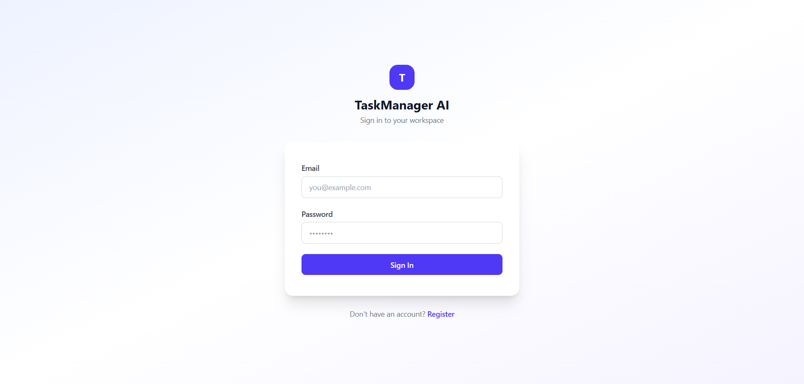
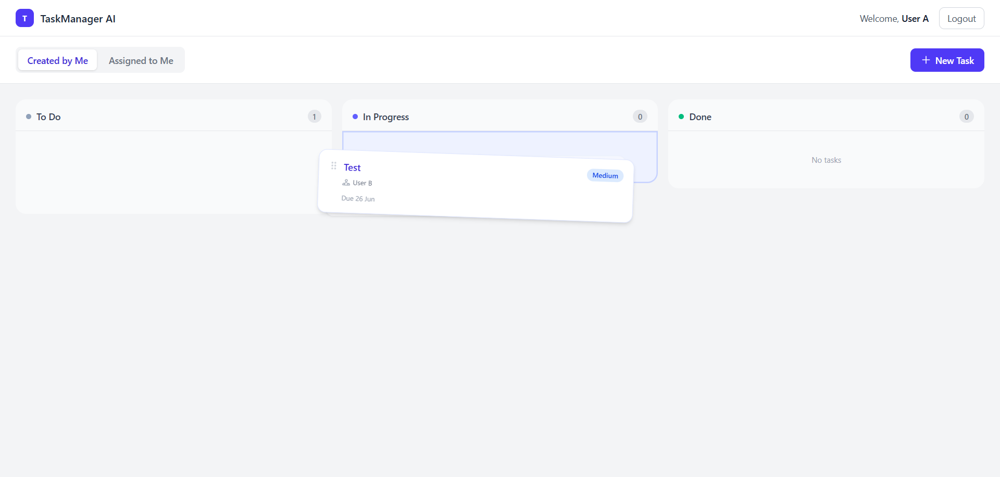
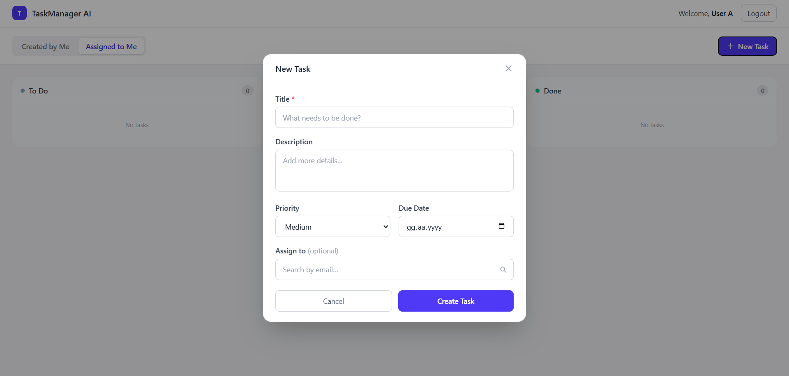
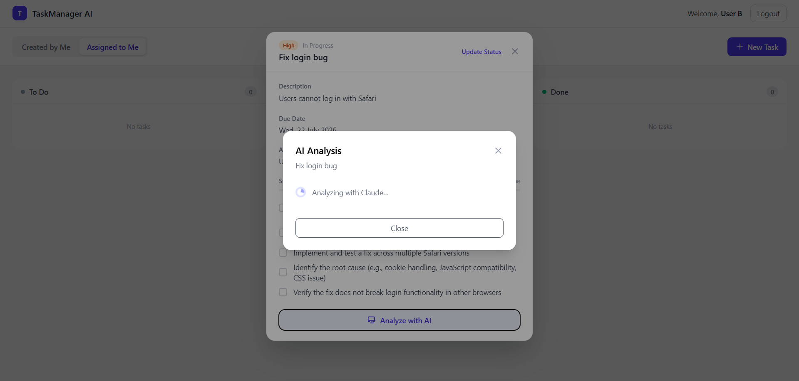
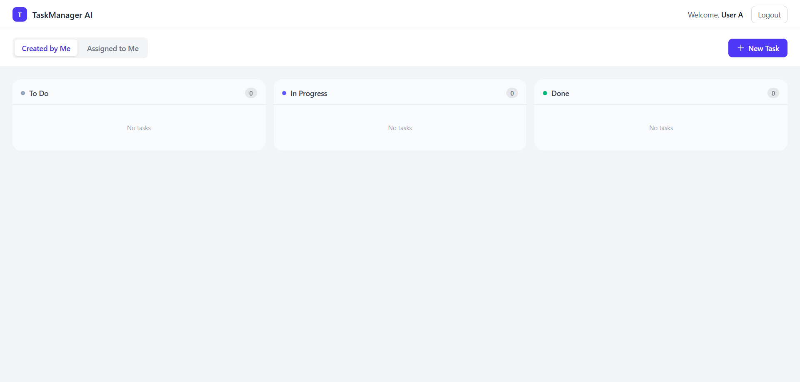

# TaskManagerAI

A full-stack, AI-powered task management application built as a portfolio demonstration.


---

## Overview

TaskManagerAI is a production-grade task management application that integrates Anthropic's Claude AI to analyze tasks, suggest priority levels, and generate subtask breakdowns. It features real-time notifications via SignalR, a drag-and-drop Kanban board, and a role-based permission system distinguishing task owners from assignees. The project targets software development teams and project managers who want AI assistance embedded directly in their workflow tools.

---

## Features

- JWT authentication with secure registration and login
- Full task CRUD with Kanban board (Todo, In Progress, Done)
- AI-powered task analysis via Claude: priority suggestion and subtask generation
- Real-time push notifications via SignalR when a task is assigned
- User assignment with debounced typeahead search
- Drag-and-drop status updates with optimistic UI updates
- Dual views: "Created by Me" and "Assigned to Me"
- Role-based permissions: owners can edit all fields; assignees can update status only
- Filtering by status and priority across both views

---

## Tech Stack

### Backend

| Technology | Purpose |
|---|---|
| ASP.NET Core 8 | Web API framework |
| C# | Primary language |
| Entity Framework Core 8 | ORM and database migrations |
| PostgreSQL 16 | Relational database |
| SignalR | Real-time WebSocket notifications |
| MediatR | CQRS pattern (Commands and Queries) |
| AutoMapper | Object-to-DTO mapping |
| FluentValidation | Input validation pipeline |
| JWT Bearer | Authentication and authorization |
| BCrypt.Net | Password hashing |
| Anthropic.SDK | Claude AI integration |

### Frontend

| Technology | Purpose |
|---|---|
| React 19 | UI framework |
| TypeScript 5 | Type-safe development |
| Vite 8 | Build tool and dev server |
| Tailwind CSS v4 | Utility-first styling |
| dnd-kit | Drag-and-drop Kanban interactions |
| Axios | HTTP client with interceptors |
| @microsoft/signalr | SignalR client |
| React Router v7 | Client-side routing |

---

## Architecture

The backend follows **Clean Architecture** with four distinct layers, each with a single responsibility and a strict inward dependency rule.

```
┌─────────────────────────────────────────────┐
│                  API Layer                  │  Controllers, Middleware, SignalR Hubs
│         (TaskManagerAI.API)                 │  Depends on: Application, Infrastructure
├─────────────────────────────────────────────┤
│           Infrastructure Layer              │  EF Core, Repositories, JWT, BCrypt,
│      (TaskManagerAI.Infrastructure)         │  Claude AI Service, SignalR Service
│                                             │  Depends on: Application, Domain
├─────────────────────────────────────────────┤
│           Application Layer                 │  CQRS Handlers, DTOs, Validators,
│        (TaskManagerAI.Application)          │  Service Interfaces, AutoMapper Profiles
│                                             │  Depends on: Domain only
├─────────────────────────────────────────────┤
│              Domain Layer                   │  Entities, Enums, Repository Interfaces
│         (TaskManagerAI.Domain)              │  No external dependencies
└─────────────────────────────────────────────┘
```

Key patterns used:

- **CQRS via MediatR**: every write is a `Command`, every read is a `Query`; handlers live in `Application/Features/{Feature}/`
- **Repository pattern**: domain-defined interfaces implemented in Infrastructure; handlers never reference EF Core directly
- **Validation pipeline**: `ValidationBehavior<TRequest, TResponse>` runs FluentValidation before every handler via MediatR's `IPipelineBehavior`
- **Global exception middleware**: domain exceptions (`NotFoundException`, `ForbiddenException`, `ConflictException`) are caught once and translated to consistent HTTP responses

---

## Screenshots

### Login Screen



Secure authentication with email and password. New users can register directly from the login page.

### Kanban Dashboard



Three-column Kanban board with drag-and-drop support. Switch between "Created by Me" and "Assigned to Me" views using the tab bar.

### Task Creation



Create tasks with title, description, priority, due date, and an optional assignee selected via typeahead search.

### AI-Powered Task Analysis



Claude AI analyzes a task's title and description, then returns a suggested priority level, a list of actionable subtasks, and a brief reasoning summary.

### Empty Board State



Clean empty state shown when a view has no tasks yet.

---

## Getting Started

### Prerequisites

- [.NET 8 SDK](https://dotnet.microsoft.com/download/dotnet/8.0)
- [Node.js 18+](https://nodejs.org/)
- [Docker Desktop](https://www.docker.com/products/docker-desktop/) (for PostgreSQL)
- An [Anthropic API key](https://console.anthropic.com)

### Backend Setup

**1. Start the PostgreSQL database**

```bash
docker compose up -d
```

This starts a PostgreSQL 16 container on port 5432 with a persistent volume.

**2. Configure secrets**

```bash
cp src/TaskManagerAI.API/appsettings.Development.json.example \
   src/TaskManagerAI.API/appsettings.Development.json
```

Open `appsettings.Development.json` and fill in the required values:

```json
{
  "ConnectionStrings": {
    "DefaultConnection": "Host=localhost;Port=5432;Database=taskmanagerai;Username=postgres;Password=YOUR_DB_PASSWORD_HERE"
  },
  "JwtSettings": {
    "SecretKey": "YOUR_JWT_SECRET_KEY_MIN_32_CHARS_HERE"
  },
  "AnthropicSettings": {
    "ApiKey": "YOUR_ANTHROPIC_API_KEY_HERE"
  }
}
```

**3. Apply database migrations**

```bash
dotnet ef database update \
  --project src/TaskManagerAI.Infrastructure \
  --startup-project src/TaskManagerAI.API
```

**4. Run the API**

```bash
dotnet run --project src/TaskManagerAI.API
```

The API will be available at `http://localhost:5202`. Swagger UI is at `http://localhost:5202/swagger`.

### Frontend Setup

**1. Install dependencies**

```bash
cd client
npm install
```

**2. Configure environment**

```bash
cp client/.env.example client/.env
```

The default `VITE_API_URL=http://localhost:5202` works with the local backend without changes.

**3. Start the dev server**

```bash
npm run dev
```

The frontend will be available at `http://localhost:5173`.

---

## API Endpoints

### Authentication

| Method | Path | Description | Auth Required |
|---|---|---|---|
| `POST` | `/api/auth/register` | Register a new user | No |
| `POST` | `/api/auth/login` | Authenticate and receive a JWT | No |

### Tasks

| Method | Path | Description | Auth Required |
|---|---|---|---|
| `GET` | `/api/tasks?view=created` | List tasks created by the current user | Yes |
| `GET` | `/api/tasks?view=assigned` | List tasks assigned to the current user | Yes |
| `GET` | `/api/tasks/{id}` | Get a single task with subtasks | Yes |
| `POST` | `/api/tasks` | Create a new task | Yes |
| `PUT` | `/api/tasks/{id}` | Update a task (owner: all fields; assignee: status only) | Yes |
| `DELETE` | `/api/tasks/{id}` | Delete a task (owner only) | Yes |
| `POST` | `/api/tasks/{id}/subtasks` | Add a subtask | Yes |
| `POST` | `/api/tasks/{id}/assign` | Assign a task to a user | Yes |

### AI Analysis

| Method | Path | Description | Auth Required |
|---|---|---|---|
| `POST` | `/api/tasks/{id}/analyze` | Analyze task with Claude AI | Yes |
| `POST` | `/api/tasks/{id}/analyze?apply=true` | Analyze and apply suggestions | Yes |

### Users

| Method | Path | Description | Auth Required |
|---|---|---|---|
| `GET` | `/api/users/search?query={text}` | Search users by email prefix | Yes |

### SignalR Hub

| Endpoint | Event | Description |
|---|---|---|
| `/hubs/tasks` | `TaskAssigned` | Fires when a task is assigned to the connected user |

---

## Project Structure

```
task-manager-demo/
├── src/
│   ├── TaskManagerAI.API/           # Controllers, hubs, middleware, Swagger config
│   ├── TaskManagerAI.Application/   # CQRS handlers, DTOs, validators, interfaces
│   ├── TaskManagerAI.Domain/        # Entities, enums, repository contracts
│   └── TaskManagerAI.Infrastructure/# EF Core, repositories, external services
├── client/                          # React + TypeScript frontend
│   └── src/
│       ├── components/              # TaskCard, KanbanColumn, modals, UserSearchInput
│       ├── context/                 # AuthContext
│       ├── hooks/                   # useDebounce
│       ├── pages/                   # Login, Register, Dashboard
│       ├── services/                # api, authService, taskService, signalrService
│       └── types/                   # TypeScript interfaces
├── docs/screenshots/                # Portfolio screenshots
├── docker-compose.yml               # PostgreSQL 16 development database
└── TaskManagerAI.sln
```

---

## License

MIT License. See [LICENSE](LICENSE) for details.
